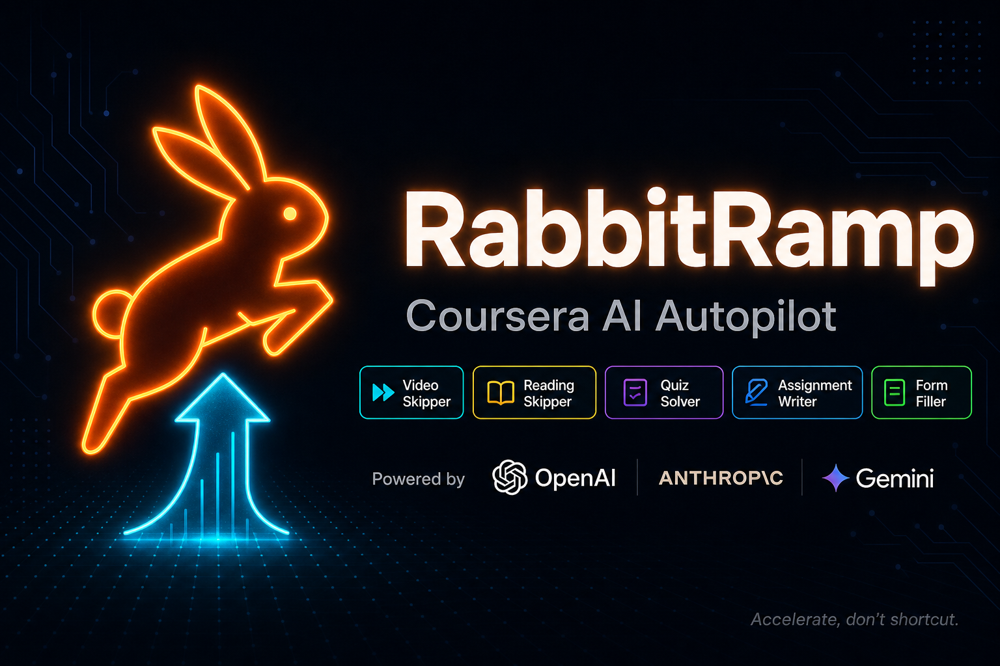

# RabbitRamp

<div align="center">

<!-- Banner generated using Claude (Anthropic) -->


<br/><br/>

-brightgreen?style=flat-square&logo=statuspage&logoColor=white)


</div>

---

## What is RabbitRamp?

A Chrome extension that automates Coursera coursework using AI — skip videos and readings, solve quizzes, and write assignments with one click.

No coding experience required to use it. Just install, add your API key, and go.

## Demo

Screen recording (~2 min):

**GitHub does not render `<video>` embeds in README files**, so use the link below — it opens the MP4 on GitHub’s file viewer, which includes an inline player.

→ **[Play demo video (`demo-screen-recording.mp4`)](assets/demo-screen-recording.mp4)**

(On that page, use the **⋯** menu → **Download** if you want the file locally.)

## Features

| Skill | What it does |
|---|---|
| **Video Skipper** | Jumps to the end of lecture videos instantly |
| **Reading Skipper** | Marks reading items as complete without scrolling through them |
| **Quiz Solver** | Parses quiz questions and fills answers via AI (multiple-choice, checkbox, and free-text) |
| **Assignment Writer** | Drafts peer-graded assignment responses using AI |
| **Form Filler** | Completes survey/reflection forms automatically |

Additional options: **auto-submit**, **auto-next** (navigates to the next item after completion), and a configurable **delay** between actions.

## AI Providers

RabbitRamp routes requests through whichever provider you configure, in priority order:

| Provider | Default Model | Notes |
|---|---|---|
| **OpenAI** | `gpt-4o` | Best overall quality |
| **Anthropic** | `claude-haiku-4-5-20251001` | Fast and cost-efficient |
| **Google Gemini** | `gemini-2.0-flash` | Free tier available |
| **Groq** | `llama-3.3-70b-versatile` | Free tier; OpenAI-compatible API |

API keys are stored locally in Chrome's extension storage (`chrome.storage.local`) and are never sent anywhere except the provider's own API endpoint.

---

## Quick Start (No Coding Required)

You do not need to be a developer to use this extension. Follow these steps:

### 1. Get a pre-built release

Download the latest `dist.zip` from the [Releases](../../releases) page and unzip it.

### 2. Load the extension in Chrome

1. Open `chrome://extensions` in your browser
2. Enable **Developer mode** using the toggle in the top-right corner
3. Click **Load unpacked** and select the unzipped `dist/` folder

### 3. Add your API key

You have two options:

**Option A — Extension Settings (recommended)**
1. Click the RabbitRamp icon in your browser toolbar
2. Open the **Options** page
3. Enter your API key for at least one provider (Groq, OpenAI, Anthropic, or Gemini) and save

**Option B — `.env` file (for developers building from source)**
Copy `.env.example` to `.env` and fill in your key:

```env
VITE_OPENAI_API_KEY=sk-...
VITE_ANTHROPIC_API_KEY=sk-ant-...
VITE_GROQ_API_KEY=gsk_...
```

> Keys added via the Options page are stored in your browser and never leave your machine. Keys in `.env` are baked into the build at compile time — never share or distribute a build that contains real keys.

### 4. Use it

1. Navigate to any Coursera course item (video, reading, quiz, or assignment)
2. Click the RabbitRamp extension icon to open the popup
3. Click **Run All** to let the extension handle the current item automatically, or trigger individual skills manually

A floating status bar on the page shows live progress.

---

## Developer Setup (Building from Source)

### Prerequisites

- Node.js ≥ 18
- pnpm (or npm)

### Install dependencies

```bash
pnpm install
```

### Build

```bash
# One-off build
pnpm build

# Watch mode (rebuilds on save)
pnpm dev
```

The built extension is output to `dist/`.

---

## Project Structure

```
src/
├── background/         # Service worker — AI routing & provider adapters
│   └── ai/             # openai.ts · anthropic.ts · gemini.ts · router.ts
├── content/            # Content script — DOM interaction
│   ├── detector.ts     # Detects current item type (video / quiz / …)
│   ├── overlay/        # Floating status bar UI
│   ├── skills/         # One file per skill (quizSolver, videoSkipper, …)
│   └── utils/          # DOM helpers (setReactInput, clickNext, …)
├── options/            # Options page (React)
├── popup/              # Popup UI (React)
└── shared/             # Types, storage helpers, message bus
```

## Tech Stack

| Layer | Tech |
|---|---|
| Build | **Vite** + **@crxjs/vite-plugin** |
| UI | **React 18** |
| Styling | **Tailwind CSS v4** |
| Language | **TypeScript 5.7** |
| AI | OpenAI API · Anthropic API · Google Gemini API |

### Type Definitions

The shared type system (`src/shared/types.ts`) covers:

- **`ItemType`** — `"video" | "reading" | "quiz" | "assignment" | "form" | "unknown"`
- **`SkillType`** — `"videoSkipper" | "readingSkipper" | "quizSolver" | "assignmentWriter" | "formFiller"`
- **`AIProvider`** — `"openai" | "anthropic" | "gemini"`
- **`QuizQuestion`** — supports `"multiple-choice" | "checkbox" | "text"` question types
- **`Settings`** — full user config including provider priority, per-provider model/key, skill toggles, and automation options

---

## License

MIT

---

## A Note From the Developer

I built RabbitRamp with one philosophy in mind: **acceleration, not deception.**

This tool was never meant for students to mindlessly bypass learning they haven't done. It exists for people who **already have the skills** but need the credentials to prove it.

Here's the reality: a senior SQL engineer shouldn't need to spend 20 hours watching intro-level Coursera videos just to earn a certificate that proves what they already know. A self-taught developer with years of practical experience shouldn't lose job opportunities to someone with more certificates and less competence. The hiring system is imperfect — certifications are often a gating mechanism, not a true measure of ability.

**RabbitRamp is for the person who:**
- Already works in the field and just needs a proof-of-skill certificate
- Is transitioning careers and wants to fast-track through content they genuinely understand
- Has a weak CV despite strong real-world experience, and needs to close that gap quickly

**It is not for:**
- Students who want to skip learning they actually need
- People who want to fake competence they don't have
- Anyone looking to deceive employers or institutions

Use it to accelerate. Don't use it to become dumb. That's the whole point.
